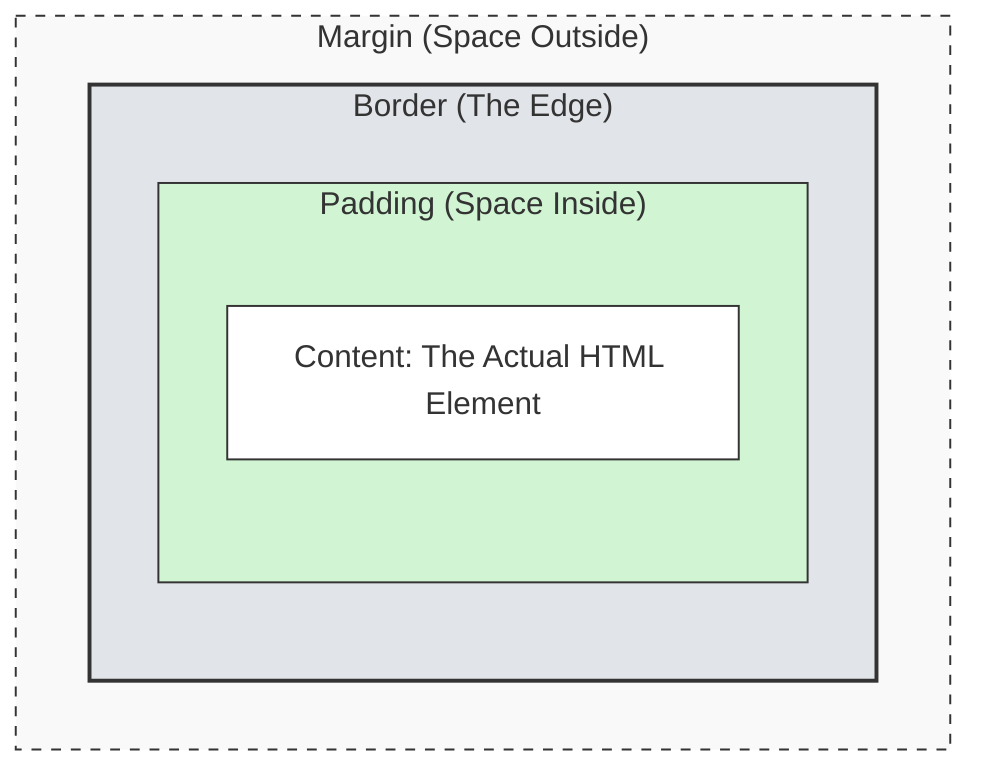

# 03. CSS (The Presentation)

If HTML is the structure (the raw bricks), CSS (Cascading Style Sheets) is the **paint, the polish, and the arrangement**. It turns a document that looks like a Word file into a branded, interactive application.

## 1. Where CSS Lives

You can write CSS in three places. While each has its use cases, **External Stylesheets** are the standard for professional applications because they allow for caching, organization, and reusability.

1.  **External Stylesheet (Recommended):** A separate `.css` file linked in the `<head>`.
    ```html
    <link rel="stylesheet" href="style.css" />
    ```
2.  **Internal Styles:** Inside a `<style>` tag. Useful for email templates or quick prototypes.
3.  **Inline Styles:** Inside the `style` attribute. Generally avoided as it is hard to maintain and overrides everything else.

## 2. Anatomy of a Rule

CSS works by **Selecting** an element and defining **Properties** for it.

```css
/* Selector */
h1 {
  /* Property: Value; */
  color: blue;
  font-size: 24px;
}
```

## 3. Selectors

How does the browser know _which_ element to style? It uses selectors to map CSS rules to HTML tags.

### Basic Connections

- **Type Selector:** Targets the HTML tag itself.
  - CSS: `p { ... }`
  - HTML: `<p>Text</p>`
- **Class Selector (`.`):** Targets the `class` attribute. _Most common._
  - CSS: `.card { ... }`
  - HTML: `<div class="card"></div>`
- **ID Selector (`#`):** Targets the `id` attribute. Use sparingly (must be unique).
  - CSS: `#header { ... }`
  - HTML: `<div id="header"></div>`

### Combining Selectors

You can chain selectors together to be more specific. This is powerful for styling specific states or finding elements via JavaScript later.

- **Tag + Class:** Targets a specific tag that _also_ has a class.
  - `h1.title` -> Targets `<h1 class="title">` (but not `<div class="title">`).
- **Multi-Class:** Targets an element that has _all_ listed classes.
  - `.btn.primary` -> Targets `<button class="btn primary">`.
- **ID + Class:**
  - `#nav.active` -> Targets `<nav id="nav" class="active">`.

### Advanced Specificity

- **Attribute Selector:** Targets elements with specific attributes.
  - CSS: `input[type="text"] { ... }`
  - HTML: `<input type="text" />`
- **Pseudo-classes:** State-based selectors.
  - `:hover`: Applied when the mouse is over the element.
  - `:focus`: Applied when the element is selected via keyboard or click (essential for accessibility).
  - `:nth-child(n)`: Selects the _nth_ child of a parent.
    - Example: `li:nth-child(2)` selects the second item in a list.
    - Example: `tr:nth-child(even)` is great for "zebra striping" tables.

## 4. The Cascade (Who Wins?)

If two rules try to style the same element, the browser has to decide which one to apply.

**Rule 1: Specificity (The Point System)**

1.  **Inline Styles** (Strongest)
2.  **ID Selectors** (`#id`)
3.  **Class Selectors** (`.class`)
4.  **Type Selectors** (`div`) (Weakest)

**Rule 2: Order of Appearance (The Tie-Breaker)**
If two rules have the _same_ specificity, the one that appears **last** in the code wins.

```css
/* In this case, the text will be BLUE because it is read last. */
h1 {
  color: red;
}
h1 {
  color: blue;
}
```

## 5. CSS Units (Measuring Things)

In design tools, everything is pixels. In CSS, we have smarter units that adapt to screen sizes and user preferences.

| Unit  | Name            | Description                                                                                                               | Best For                                                    |
| :---- | :-------------- | :------------------------------------------------------------------------------------------------------------------------ | :---------------------------------------------------------- |
| `px`  | Pixels          | Absolute unit. Does not change.                                                                                           | Borders, precise geometry.                                  |
| `%`   | Percent         | Relative to the **parent** element.                                                                                       | Layout widths (e.g., `width: 50%`).                         |
| `rem` | Root Em         | Relative to the browser's default font size (usually 16px). If a user zooms their browser text settings, `rem` scales up. | **Typography, Padding, Margins.** (Accessibility standard). |
| `em`  | Em              | Relative to the **current element's** font size.                                                                          | Compounding sizing (use with caution).                      |
| `vh`  | Viewport Height | 1% of the screen height.                                                                                                  | Full-screen hero sections (`100vh`).                        |
| `vw`  | Viewport Width  | 1% of the screen width.                                                                                                   | Full-width text scaling.                                    |

## 6. The Box Model

This is the most critical concept in CSS. Every element on a web page is a rectangular box. That box has layers:



1.  **Content:** The actual HTML content (text, image, or children nodes).
2.  **Padding:** Space _inside_ the border. Pushes the border away from the content.
3.  **Border:** The line wrapping the element.
4.  **Margin:** Space _outside_ the border. Pushes other elements away.

> **Pro Tip:** By default, `width` only sets the size of the _Content_. If you add padding, the total size of the element grows. Engineers usually fix this by setting `box-sizing: border-box` on all elements, so `width` includes the padding and border.

## 7. Layout & Display

The `display` property controls how an element behaves in the flow of the page.

- **`block`** (Default for `div`, `p`, `h1`): Takes up the full width available and starts on a new line. Stacks vertically like bricks.
- **`inline`** (Default for `span`, `a`): Flows horizontally with text. It ignores top/bottom margins and cannot have a set width or height.
- **`inline-block`**: Flows like text, but respects width, height, margins, and padding.
- **`none`**: Removes the element from the DOM rendering entirely (it becomes invisible and takes up no space).

### Positioning

The `position` property takes an element out of the normal flow.

1.  `static` (Default): Normal flow.
2.  `relative`: Normal flow, but allows you to nudge it using `top`/`left`. It also becomes a "boundary" for absolute children.
3.  `absolute`: Removed from flow. Positioned relative to the nearest _positioned_ ancestor.
4.  `fixed`: Stuck to the viewport (screen). Does not scroll.
5.  `sticky`: Scrolls until it hits a threshold, then sticks.

## 8. The Designer's Dictionary (Figma to CSS)

If you are coming from a design background, here is how the tools you know map to the code you are writing.

| CSS Property         | Figma Equivalent          | Notes                                                                 |
| :------------------- | :------------------------ | :-------------------------------------------------------------------- |
| `color`              | **Fill** (Text)           |                                                                       |
| `background-color`   | **Fill** (Layer)          |                                                                       |
| `padding`            | **Auto Layout Padding**   | Space inside the frame.                                               |
| `gap`                | **Auto Layout Gap**       | Space between items in a Flex/Grid container.                         |
| `margin`             | **Item Spacing**          | Figma doesn't have true "margin", but this is the space around items. |
| `border-radius`      | **Corner Radius**         |                                                                       |
| `border`             | **Stroke**                |                                                                       |
| `box-shadow`         | **Effects (Drop Shadow)** |                                                                       |
| `display: flex`      | **Auto Layout**           | The web's primary layout engine.                                      |
| `position: absolute` | **Absolute Position**     | Removes item from Auto Layout flow.                                   |
| `z-index`            | **Layer Order**           | Controls stack order (higher number = on top).                        |

## Assignment: The Skin

You will now apply these concepts to your "ugly" HTML profile card to make it look professional.

[-> Go to the Assignment](./assignment/README.md)
