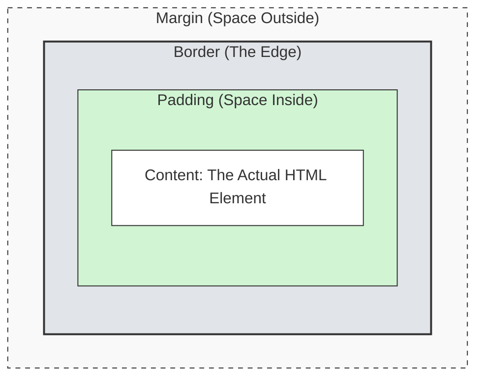

# 03. CSS (The Presentation)

If HTML is the structure (the raw bricks), CSS (Cascading Style Sheets) is the **paint, the polish, and the arrangement**. It turns a document that looks like a Word file into a branded, interactive application.

## 1. Where CSS Lives

You can write CSS in three places. While each has its use cases, **External Stylesheets** are the standard for professional applications because they allow for caching, organization, and reusability.

1.  **External Stylesheet (Recommended):** A separate `.css` file linked in the `<head>`.
    ```html
    <link rel="stylesheet" href="style.css" />
    ```
2.  **Internal Styles:** Inside a `<style>` tag. Useful for email templates or quick prototypes.
3.  **Inline Styles:** Inside the `style` attribute. Generally avoided as it is hard to maintain and overrides everything else.

## 2. Anatomy of a Rule

A CSS rule consists of a **Selector** and a **Declaration Block**.

```css
/* Selector */
h1 {
  /* Declaration Block */
  color: blue; /* Declaration (Property: Value) */
  font-size: 24px; /* Declaration (Property: Value) */
}
```

<div style="padding: 20px; background: #f5f5f5; border-radius: 8px; margin: 20px 0;">
  <p style="color: blue; font-size: 24px;">This heading is styled by the CSS selector block above.</p>
</div>

- **Selector (`h1`)**: Tells the browser _which_ HTML element(s) to target.
- **Declaration Block (`{ ... }`)**: Contains the style rules.
- **Property (`color`)**: The specific aspect you want to change (e.g., color, size, margin).
- **Value (`blue`)**: The setting you want to apply to that property.

## 3. Selectors

How does the browser know _which_ element to style? It uses selectors to map CSS rules to HTML tags.

### Basic Connections

- **Tag Selector:** Targets the HTML tag itself.
  - CSS: `p { ... }`
  - HTML: `<p>Text</p>`
- **Class Selector (`.`):** Targets the `class` attribute. _Most common._
  - CSS: `.card { ... }`
  - HTML: `<div class="card"></div>`
- **ID Selector (`#`):** Targets the `id` attribute. Use sparingly (must be unique).
  - CSS: `#header { ... }`
  - HTML: `<div id="header"></div>`
- **Universal Selector (`*`):** Targets _every_ element on the page.
  - CSS: `* { ... }`
  - Use case: Often used for resetting margins/padding (e.g., `* { box-sizing: border-box; }`).

### Combining Selectors

You can chain selectors together to be more specific. This is powerful for styling specific states or finding elements via JavaScript later.

- **Tag + Class:** Targets a specific tag that _also_ has a class.
  - `h1.title` -> Targets `<h1 class="title">` (but not `<div class="title">`).
- **Multi-Class:** Targets an element that has _all_ listed classes.
  - `.btn.primary` -> Targets `<button class="btn primary">`.
- **ID + Class:**
  - `#nav.active` -> Targets `<nav id="nav" class="active">`.

### Grouping Selectors

You can target multiple elements at once by separating selectors with a comma. This helps avoid repeating code.

- **Syntax:** `selector, selector { ... }`
- **Example:**
  ```css
  h1,
  h2,
  .title {
    color: navy;
  }
  ```
  ```html
  <h1>Heading 1</h1>
  <h2>Heading 2</h2>
  <div class="title">Title</div>
  ```
  This applies the color navy to all `h1` tags, all `h2` tags, and any element with the class `.title`.

<div style="padding: 20px; background: #f5f5f5; border-radius: 8px; margin: 20px 0; color: #000">
  <p style="font-size: 28px; font-weight: 600;">Heading 1</p>
  <p style="font-size: 24px; font-weight: 500;">Heading 2</p>
  <p class="title">Title</p>
</div>

### Advanced Specificity

- **Attribute Selector:** Targets elements with specific attributes.
  - CSS: `input[type="text"] { ... }`
  - HTML: `<input type="text" />`
- **Pseudo-selectors:** State-based selectors.
  - `:hover`: Applied when the mouse is over the element.

<div style="padding: 20px; background: #f5f5f5; border-radius: 8px; margin: 20px 0;">
  <button style="padding: 10px 20px; background: #2196F3; color: white; border: none; border-radius: 4px; cursor: pointer; transition: all 0.3s;" onmouseover="this.style.background='#1976D2'; this.style.transform='scale(1.05)'" onmouseout="this.style.background='#2196F3'; this.style.transform='scale(1)'">Hover Over Me!</button>
</div>

```css
button {
  padding: 10px 20px;
  background: #2196f3;
  color: white;
  transition: all 0.3s;
}

button:hover {
  background: #1976d2;
  transform: scale(1.05);
}
```

- `:focus`: Applied when the element is selected via keyboard or click (essential for accessibility).

<div style="padding: 20px; background: #f5f5f5; border-radius: 8px; margin: 20px 0;">
  <input type="text" placeholder="Click or tab to focus" style="padding: 10px; border: 2px solid #ccc; border-radius: 4px; transition: border-color 0.3s; width: 100%; max-width: 300px;" onfocus="this.style.borderColor='#4CAF50'; this.style.boxShadow='0 0 0 3px rgba(76, 175, 80, 0.2)'" onblur="this.style.borderColor='#ccc'; this.style.boxShadow='none'" />
  <p style="font-size: 0.9em; color: #666; margin-top: 8px;">Notice the green border when focused</p>
</div>

```css
input {
  padding: 10px;
  border: 2px solid #ccc;
  border-radius: 4px;
  transition: border-color 0.3s;
}

input:focus {
  border-color: #4caf50;
  box-shadow: 0 0 0 3px rgba(76, 175, 80, 0.2);
  outline: none; /* Remove default browser outline */
}
```

- `:nth-child(n)`: Selects the _nth_ child of a parent.
  - Example: `li:nth-child(2)` selects the second item in a list.
  - Example: `tr:nth-child(even)` is great for "zebra striping" tables.

<div style="padding: 20px; background: #f5f5f5; border-radius: 8px; margin: 20px 0;">
  <ul style="list-style: none; padding: 0;">
    <li style="padding: 10px; background: #fff; margin: 4px 0; border-radius: 4px;">Item 1</li>
    <li style="padding: 10px; background: #e3f2fd; margin: 4px 0; border-radius: 4px;">Item 2 (even)</li>
    <li style="padding: 10px; background: #fff; margin: 4px 0; border-radius: 4px;">Item 3</li>
    <li style="padding: 10px; background: #e3f2fd; margin: 4px 0; border-radius: 4px;">Item 4 (even)</li>
    <li style="padding: 10px; background: #fff; margin: 4px 0; border-radius: 4px;">Item 5</li>
  </ul>
</div>

```css
li {
  padding: 10px;
  margin: 4px 0;
  border-radius: 4px;
}

li:nth-child(even) {
  background: #e3f2fd;
}

li:nth-child(odd) {
  background: #fff;
}
```

## 4. Mastering Classes

Classes are the most flexible tool in CSS. You can assign **multiple classes** to a single HTML element to combine styles. This allows you to create a "base" style and then "modify" it.

### Applying Multiple Classes in HTML

Separate class names with a space inside the `class` attribute.

```html
<!-- This button has two classes: 'btn' and 'primary' -->
<button class="btn primary">Click Me</button>
```

### Styling Multiple Classes

You can write rules for each class individually, or target the specific combination.

```css
/* 1. Base Style (Applies to all buttons) */
.btn {
  padding: 10px 20px;
  border-radius: 5px;
}

/* 2. Modifier Style (Applies only to .primary) */
.primary {
  background-color: blue;
  color: white;
}

/* 3. Combination Selector (Targeting BOTH) */
/* Only applies if an element has BOTH classes */
.btn.primary {
  font-weight: bold;
}
```

<div style="padding: 20px; background: #f5f5f5; border-radius: 8px; margin: 20px 0;">
  <div style="display: flex; gap: 15px; flex-wrap: wrap; align-items: center;">
    <!-- Just .btn -->
    <div>
      <button style="padding: 10px 20px; border-radius: 5px; border: 2px solid #ddd; background: white; display: inline-block; border: none;">
        class="btn"
      </button>
      <p style="font-size: 0.8em; color: #666; margin-top: 5px;">✅ padding, border-radius</p>
    </div>
    <div>
      <button style="background-color: blue; color: white; display: inline-block; padding: 8px 12px; border: none;">
        class="primary"
      </button>
      <p style="font-size: 0.8em; color: #666; margin-top: 5px;">✅ blue background, white text</p>
    </div>
    <div>
      <button style="padding: 10px 20px; border-radius: 5px; background-color: blue; color: white; font-weight: bold; display: inline-block; border: none;">
        class="btn primary"
      </button>
      <p style="font-size: 0.8em; color: #666; margin-top: 5px;">✅ ALL styles combined + bold!</p>
    </div>
  </div>
</div>

In this example, the button gets the padding/radius from `.btn`, the color from `.primary`, AND the bold font because it has both.

## 5. The Cascade (Who Wins?)

If two rules try to style the same element, the browser has to decide which one to apply.

**Rule 1: Specificity (The Point System)**

1.  **Inline Styles** (Strongest)
2.  **ID Selectors** (`#id`)
3.  **Class Selectors** (`.class`)
4.  **Type Selectors** (`div`) (Weakest)

**Rule 2: Order of Appearance (The Tie-Breaker)**
If two rules have the _same_ specificity, the one that appears **last** in the code wins.

```css
/* In this case, the text will be BLUE because it is read last. */
h1 {
  color: red;
}
h1 {
  color: blue;
}
```

## 7. The Box Model

This is the most critical concept in CSS. Every element on a web page is a rectangular box. That box has layers:



1.  **Content:** The actual HTML content (text, image, or children nodes).
2.  **Padding:** Space _inside_ the border. Pushes the border away from the content.
3.  **Border:** The line wrapping the element.
4.  **Margin:** Space _outside_ the border. Pushes other elements away.

> **Pro Tip:** By default, `width` only sets the size of the _Content_. If you add padding, the total size of the element grows. Engineers usually fix this by setting `box-sizing: border-box` on all elements, so `width` includes the padding and border.

<div style="padding: 30px; background: #f0f0f0; border-radius: 8px; margin: 20px 0;">
  <div style="background: #FFA726; padding: 30px; display: inline-block; border-radius: 4px;">
    <div style="border: 5px solid #EF6C00; padding: 0; display: inline-block;">
      <div style="background: #81C784; padding: 20px; display: inline-block;">
        <div style="background: #fff; padding: 20px; text-align: center; min-width: 150px;">
          <strong>Content</strong><br/>
          <span style="font-size: 0.85em;">The actual element</span>
        </div>
      </div>
    </div>
  </div>
  <div style="margin-top: 20px; background: white; padding: 15px; border-radius: 4px;">
    <div style="display: grid; grid-template-columns: auto 1fr; gap: 12px; font-size: 0.9em;">
      <div style="width: 20px; height: 20px; background: #FFA726;"></div>
      <div><strong>Margin (Orange):</strong> Space outside the border - pushes other elements away</div>
      <div style="width: 20px; height: 20px; background: #EF6C00;"></div>
      <div><strong>Border (Dark Orange):</strong> The edge/outline of the element</div>
      <div style="width: 20px; height: 20px; background: #81C784;"></div>
      <div><strong>Padding (Green):</strong> Space inside the border - pushes content away from edges</div>
      <div style="width: 20px; height: 20px; background: #fff; border: 1px solid #ccc;"></div>
      <div><strong>Content (White):</strong> Your text, images, or child elements</div>
    </div>
  </div>
</div>

## 8. Layout & Display

The `display` property controls how an element behaves in the flow of the page.

- **`block`** (Default for `div`, `p`, `h1`): Takes up the full width available and starts on a new line. Stacks vertically like bricks.
- **`inline`** (Default for `span`, `a`): Flows horizontally with text. It ignores top/bottom margins and cannot have a set width or height.
- **`inline-block`**: Flows like text, but respects width, height, margins, and padding.
- **`none`**: Removes the element from the DOM rendering entirely (it becomes invisible and takes up no space).

<div style="padding: 20px; background: #e1f5fe; border-radius: 8px; margin: 20px 0;">
  
  <div style="margin-bottom: 20px;">
    <strong>display: block</strong> <span style="font-size: 0.85em; color: #666;">(stacks vertically, takes full width)</span>
    <div style="margin-top: 8px;">
      <div style="display: block; background: #FF5722; color: white; padding: 10px; margin: 4px 0; width: 150px;">Block 1</div>
      <div style="display: block; background: #FF5722; color: white; padding: 10px; margin: 4px 0; width: 150px;">Block 2</div>
      <div style="display: block; background: #FF5722; color: white; padding: 10px; margin: 4px 0; width: 150px;">Block 3</div>
    </div>
  </div>
  
  <div style="margin-bottom: 20px;">
    <strong>display: inline</strong> <span style="font-size: 0.85em; color: #666;">(flows with text, ignores width/height)</span>
    <div style="margin-top: 8px;">
      <span style="display: inline; background: #4CAF50; color: white; padding: 10px; margin: 4px;">Inline 1</span>
      <span style="display: inline; background: #4CAF50; color: white; padding: 10px; margin: 4px;">Inline 2</span>
      <span style="display: inline; background: #4CAF50; color: white; padding: 10px; margin: 4px;">Inline 3</span>
    </div>
  </div>
  
  <div>
    <strong>display: inline-block</strong> <span style="font-size: 0.85em; color: #666;">(flows like inline, but respects width/height)</span>
    <div style="margin-top: 8px;">
      <div style="display: inline-block; background: #2196F3; color: white; padding: 10px; margin: 4px; width: 100px; text-align: center;">Inline-Block 1</div>
      <div style="display: inline-block; background: #2196F3; color: white; padding: 10px; margin: 4px; width: 100px; text-align: center;">Inline-Block 2</div>
      <div style="display: inline-block; background: #2196F3; color: white; padding: 10px; margin: 4px; width: 100px; text-align: center;">Inline-Block 3</div>
    </div>
  </div>
</div>

### Positioning

The `position` property takes an element out of the normal flow.

1.  `static` (Default): Normal flow.
2.  `relative`: Normal flow, but allows you to nudge it using `top`/`left`. It also becomes a "boundary" for absolute children.
3.  `absolute`: Removed from flow. Positioned relative to the nearest _positioned_ ancestor.
4.  `fixed`: Stuck to the viewport (screen). Does not scroll.
5.  `sticky`: Scrolls until it hits a threshold, then sticks.

<div style="padding: 20px; background: #fff3e0; border-radius: 8px; margin: 20px 0;">
  
  <div style="background: white; padding: 15px; border: 2px solid #ddd; border-radius: 4px; margin-bottom: 15px; height: 200px; position: relative;">
    <strong>Parent Container (position: relative)</strong>
    <div style="margin-top: 10px; color: #666; font-size: 0.9em;">This gray box is the positioned ancestor</div>
    <div style="position: static; background: #90CAF9; padding: 10px; margin: 10px 0; width: fit-content; border-radius: 4px;">
      <strong>position: static</strong><br/>
      <span style="font-size: 0.85em;">Normal flow (default)</span>
    </div>
    <div style="position: relative; background: #81C784; padding: 10px; margin: 10px 0; width: fit-content; left: 30px; top: 10px; border-radius: 4px;">
      <strong>position: relative</strong><br/>
      <span style="font-size: 0.85em;">Nudged 30px left, 10px down from original spot</span>
    </div>    
    <div style="position: absolute; background: #FFB74D; padding: 10px; width: fit-content; right: 20px; bottom: 20px; border-radius: 4px;">
      <strong>position: absolute</strong><br/>
      <span style="font-size: 0.85em;">20px from parent's right & bottom</span>
    </div>
  </div>
  <div style="background: #f5f5f5; padding: 10px; border-radius: 4px; font-size: 0.9em;">
    <strong>Note:</strong> <code style="background: white; padding: 2px 6px; border-radius: 3px;">position: fixed</code> would stick to your viewport (browser window) and scroll with the page. <code style="background: white; padding: 2px 6px; border-radius: 3px;">position: sticky</code> acts like relative until you scroll past it, then it "sticks" to the top.
  </div>
</div>

## 9. Modern Layouts (Flexbox & Grid)

We used to use "floats" to align things. Now we have engines that match the design tools you are used to.

### Flexbox (1-Dimensional)

Flexbox is the best tool for laying out items in a single row or a single column. It is the industry standard for component layout.

- **Figma Translation:** This is exactly the same as **Auto Layout**.
  - **Direction:** `flex-direction` matches the Horizontal (→) / Vertical (↓) arrows.
  - **Alignment:** `justify-content` and `align-items` match the alignment box.
  - **Spacing:** `gap` matches the "Spacing between items" field.

To use it, you apply `display: flex` to the **Parent Container**. You then control the children using these properties:

| Property              | What it does                                                | Common Values                               |
| :-------------------- | :---------------------------------------------------------- | :------------------------------------------ |
| **`flex-direction`**  | Decides if items stack horizontally or vertically.          | `row` (default), `column`                   |
| **`justify-content`** | Aligns items along the **Main Axis** (Left/Right for rows). | `flex-start`, `center`, `space-between`     |
| **`align-items`**     | Aligns items along the **Cross Axis** (Up/Down for rows).   | `stretch` (default), `center`, `flex-start` |
| **`gap`**             | Adds space between items (but not on the outside).          | `10px`, `1rem`                              |

To center a card perfectly in the middle of the screen, you treat the parent container as the Flex container:

```css
.parent {
  display: flex;
  justify-content: center; /* Center horizontally */
  align-items: center; /* Center vertically */
  min-height: 100vh; /* Ensure parent is full height */
}
```

<div style="padding: 20px; background: #e0f7fa; border-radius: 8px; margin: 20px 0; display: flex; justify-content: center; align-items: center; height: 300px; box-sizing: border-box">
  <div style="color: #000; width: 60%; background: #ffe483ff; padding: 20px; border-radius: 4px; text-align: center;">
    This div is centered in the middle of the screen
  </div>
</div>

### Grid (2-Dimensional)

Best for complex page layouts (rows AND columns simultaneously).

- **Figma Translation:** This is like a **Layout Grid** (specifically the Columns/Rows overlay).
  - **Columns:** `grid-template-columns` defines the count and width of columns.
  - **Gutter:** `gap` matches the Gutter setting.

```css
.layout {
  display: grid;
  /* Create two columns: one is 200px, the other takes the rest */
  grid-template-columns: 200px 1fr;
  gap: 20px;
}
```

> **Note on `fr` units:** The `fr` unit stands for "fraction". It represents a fraction of the available space in the grid container. In the example above, `1fr` means "take up all the remaining space after the 200px column is drawn". If you had `1fr 1fr 1fr`, you would have three equal columns.

<div style="padding: 20px; background: #e0f7fa; border-radius: 8px; margin: 20px 0;">
  
  <div style="display: grid; grid-template-columns: 200px 1fr; gap: 20px; background: white; padding: 15px; border-radius: 4px;">
    <div style="background: #00796B; color: white; padding: 20px; border-radius: 4px; text-align: center;">
      <strong>Sidebar</strong><br/>
      <span style="font-size: 0.85em;">Fixed 200px</span>
    </div>
    <div style="background: #00897B; color: white; padding: 20px; border-radius: 4px; text-align: center;">
      <strong>Main Content</strong><br/>
      <span style="font-size: 0.85em;">1fr (takes remaining space)</span>
    </div>
  </div>
  
  <h4 style="margin-top: 25px; margin-bottom: 10px;">Equal 3-Column Grid (1fr 1fr 1fr)</h4>
  
  <div style="display: grid; grid-template-columns: 1fr 1fr 1fr; gap: 15px; background: white; padding: 15px; border-radius: 4px;">
    <div style="background: #0097A7; color: white; padding: 20px; border-radius: 4px; text-align: center;">Column 1</div>
    <div style="background: #0097A7; color: white; padding: 20px; border-radius: 4px; text-align: center;">Column 2</div>
    <div style="background: #0097A7; color: white; padding: 20px; border-radius: 4px; text-align: center;">Column 3</div>
  </div>
  
  <p style="margin-top: 15px; font-size: 0.9em; color: #666;"><strong>Resize your browser window</strong> to see how <code>fr</code> units adapt to available space!</p>
</div>

## 10. CSS Value Types Reference

Before diving into specific properties, here are the common value types you'll use throughout CSS. Properties will reference these types rather than repeating them.

### Length Measurements

Used for sizing, spacing, and positioning.

| Unit  | Name            | Description                                                                                                                     | Example         |
| :---- | :-------------- | :------------------------------------------------------------------------------------------------------------------------------ | :-------------- |
| `px`  | Pixels          | Fixed size, does not scale                                                                                                      | `20px`, `1px`   |
| `rem` | Root Em         | Relative to root font size (usually 16px), **recommended for accessibility**                                                    | `1rem`, `2rem`  |
| `em`  | Em              | Relative to parent's font size                                                                                                  | `1.5em`, `2em`  |
| `%`   | Percent         | Relative to parent element's **width** (for `padding`/`margin`, even top/bottom), or parent's width/height for `width`/`height` | `50%`, `100%`   |
| `vh`  | Viewport Height | 1% of viewport height                                                                                                           | `100vh`, `50vh` |
| `vw`  | Viewport Width  | 1% of viewport width                                                                                                            | `100vw`, `50vw` |

**Common Usage:**

- Borders, fine details: `px`
- Typography, spacing: `rem` (scales with user preferences)
- Layout widths: `%` or `vw`
- Full-screen sections: `vh`

<div style="padding: 20px; background: #e8f5e9; border-radius: 8px; margin: 20px 0;">
  <div style="display: grid; gap: 15px;">
    <div>
      <code style="background: #fff; padding: 4px 8px; border-radius: 4px;">width: 200px</code>
      <div style="width: 200px; height: 40px; background: #FF5722; color: white; display: flex; align-items: center; justify-content: center; margin-top: 8px; border-radius: 4px;">Fixed 200 pixels</div>
    </div>
    <div>
      <code style="background: #fff; padding: 4px 8px; border-radius: 4px;">width: 50%</code>
      <div style="width: 50%; height: 40px; background: #2196F3; color: white; display: flex; align-items: center; justify-content: center; margin-top: 8px; border-radius: 4px;">50% of parent</div>
    </div>
    <div>
      <code style="background: #fff; padding: 4px 8px; border-radius: 4px;">font-size: 1rem</code>
      <div style="font-size: 1rem; padding: 10px; background: #4CAF50; color: white; border-radius: 4px; margin-top: 8px;">1rem = browser default (usually 16px)</div>
    </div>
    <div>
      <code style="background: #fff; padding: 4px 8px; border-radius: 4px;">font-size: 2rem</code>
      <div style="font-size: 2rem; padding: 10px; background: #9C27B0; color: white; border-radius: 4px; margin-top: 8px;">2rem = 2x browser default</div>
    </div>
  </div>
  <p style="margin-top: 15px; font-size: 0.9em; color: #666;"><strong>Try zooming your browser</strong> (Cmd/Ctrl +): rem units scale with browser settings, px units don't!</p>
</div>

### Colors

| Format    | Description                       | Example                  |
| :-------- | :-------------------------------- | :----------------------- |
| **Named** | Predefined color names            | `red`, `blue`, `tomato`  |
| **Hex**   | Hexadecimal color codes           | `#FF5722`, `#2196F3`     |
| **RGB**   | Red, Green, Blue values (0-255)   | `rgb(255, 87, 34)`       |
| **RGBA**  | RGB with alpha transparency (0-1) | `rgba(255, 87, 34, 0.5)` |
| **HSL**   | Hue, Saturation, Lightness        | `hsl(14, 100%, 57%)`     |

**Tip:** Use RGBA when you need transparency (e.g., overlays, shadows).

---

## 11. Common CSS Properties

These are the most frequently used CSS properties you'll encounter in everyday web development. Each property is demonstrated below with code and a visual example.

### Color

Changes the text color of an element.

**Accepted Values:** See [Colors](#colors) in Value Types Reference

```css
p {
  color: #2196f3; /* Hex color */
}
```

<div style="padding: 15px; background: #f5f5f5; border-radius: 4px; margin-bottom: 20px;">
  <p style="color: #2196F3; margin: 0;">This text is blue using color: #2196F3</p>
</div>

### Background Color

Sets the background color of an element.

**Accepted Values:** See [Colors](#colors) in Value Types Reference

```css
div {
  background-color: #4caf50;
  color: white;
}
```

<div style="padding: 15px; background: #f5f5f5; border-radius: 4px; margin-bottom: 20px;">
  <div style="background-color: #4CAF50; color: white; padding: 15px; border-radius: 4px;">
    This div has a green background
  </div>
</div>

### Width & Height

Sets the dimensions of an element.

**Accepted Values:** See [Length Measurements](#length-measurements) in Value Types Reference

- `auto` (default): Browser calculates the size
- `100%` width = parent's full width
- `100%` height = parent's full height (requires parent to have a set height!)

```css
div {
  width: 100%;
  height: 200px;
}
```

<div style="padding: 15px; background: #f5f5f5; border-radius: 4px; margin-bottom: 20px;">
  <div style="width: 50%; height: 60px; background: #9C27B0; color: white; display: flex; align-items: center; justify-content: center; border-radius: 4px;">
    width: 50%; height: 60px;
  </div>
  <p style="margin-top: 15px; font-size: 0.9em; color: #666;">Notice the width is 50% of the parent container. The height is fixed at exactly 60px.</p>
</div>

### Padding

Creates space inside an element, between the content and the border.

**Accepted Values:** See [Length Measurements](#length-measurements) in Value Types Reference

**Shorthand:** `padding: [all]` or `padding: [top/bottom] [left/right]` or `padding: [top] [right] [bottom] [left]`

**Individual Properties:** `padding-top`, `padding-right`, `padding-bottom`, `padding-left`

```css
div {
  padding: 20px; /* All sides */
}

/* Or individually: */
div {
  padding-top: 10px;
  padding-right: 20px;
  padding-bottom: 10px;
  padding-left: 20px;
}
```

<div style="padding: 15px; background: #f5f5f5; border-radius: 4px; margin-bottom: 20px;">
  <div style="background: #e3f2fd; padding: 20px; border: 2px dashed #2196F3;">
    <div style="background: #fff; padding: 10px;">
      Content with 20px padding around it
    </div>
  </div>
  <p style="font-size: 0.9em; color: #666; margin-top: 10px;">The blue dashed border shows the element's edge. Padding creates space inside.</p>
</div>

### Gap

Adds space between items in a Flexbox or Grid container (not around the outside).

**Accepted Values:** See [Length Measurements](#length-measurements) in Value Types Reference

```css
.flex-container {
  display: flex;
  gap: 15px;
}
```

<div style="padding: 15px; background: #f5f5f5; border-radius: 4px; margin-bottom: 20px;">
  <div style="display: flex; gap: 15px; background: #ffe8c4ff; border-radius: 4px;">
    <div style="background: #FF9800; color: white; padding: 15px; border-radius: 4px;">Item 1</div>
    <div style="background: #FF9800; color: white; padding: 15px; border-radius: 4px;">Item 2</div>
    <div style="background: #FF9800; color: white; padding: 15px; border-radius: 4px;">Item 3</div>
  </div>
  <p style="font-size: 0.9em; color: #666; margin-top: 10px;">
    ✅ 15px space <strong>between</strong> items<br/>
    ❌ No space between items and container edges (the orange background touches the sides)
  </p>
</div>

### Margin

Creates space outside an element, pushing other elements away.

**Accepted Values:** See [Length Measurements](#length-measurements) in Value Types Reference, plus `auto` (for centering)

**Shorthand:** Same as padding - `margin: [all]` or `margin: [top/bottom] [left/right]` or `margin: [top] [right] [bottom] [left]`

**Individual Properties:** `margin-top`, `margin-right`, `margin-bottom`, `margin-left`

```css
div {
  margin: 20px;
}

/* Center horizontally: */
div {
  margin: 0 auto;
}
```

<div style="padding: 15px; background: #f5f5f5; border-radius: 4px; margin-bottom: 20px;">
  <div style="background: #f3e5f5; padding: 10px; border-radius: 4px;">
    <div style="background: #9C27B0; color: white; padding: 15px; margin: 20px; border-radius: 4px;">
      This element has 20px margin
    </div>
  </div>
  <p style="font-size: 0.9em; color: #666; margin-top: 10px;">Notice the purple space around the element - that's the margin pushing it away from the parent's edges.</p>
</div>

### Border Radius

Rounds the corners of an element.

**Accepted Values:** See [Length Measurements](#length-measurements) in Value Types Reference (especially `px` and `%`)

**Individual Properties:** `border-top-left-radius`, `border-top-right-radius`, `border-bottom-right-radius`, `border-bottom-left-radius`

```css
div {
  border-radius: 12px;
}
```

<div style="padding: 15px; background: #f5f5f5; border-radius: 4px; margin-bottom: 20px;">
  <div style="display: flex; gap: 15px; align-items: center; flex-wrap: wrap;">
    <div style="background: #00BCD4; color: white; padding: 20px; border-radius: 0; width: 100px; text-align: center;">0px</div>
    <div style="background: #00BCD4; color: white; padding: 20px; border-radius: 8px; width: 100px; text-align: center;">8px</div>
    <div style="background: #00BCD4; color: white; padding: 20px; border-radius: 16px; width: 100px; text-align: center;">16px</div>
    <div style="background: #00BCD4; color: white; padding: 20px; border-radius: 50%; width: 100px; text-align: center;">50%</div>
  </div>
</div>

**Creating Perfect Circles:**

To make a circle, use `border-radius: 50%` on an element with **equal width and height**.

```css
.circle {
  width: 100px;
  height: 100px;
  border-radius: 50%;
}
```

<div style="padding: 15px; background: #f5f5f5; border-radius: 4px; margin-bottom: 20px;">
  <div style="display: flex; gap: 15px; align-items: center; flex-wrap: wrap;">
    <div style="background: #E91E63; color: white; width: 80px; height: 80px; border-radius: 50%; display: flex; align-items: center; justify-content: center; font-size: 0.9em;">Circle</div>
    <div style="background: #9C27B0; color: white; width: 100px; height: 100px; border-radius: 50%; display: flex; align-items: center; justify-content: center;">Circle</div>
    <div style="background: #3F51B5; color: white; width: 120px; height: 120px; border-radius: 50%; display: flex; align-items: center; justify-content: center; font-size: 1.1em;">Circle</div>
  </div>
  <p style="font-size: 0.85em; color: #666; margin-top: 15px;">Why 50%? It rounds each corner by half the element's width, creating a perfect circle when width = height.</p>
</div>

### Border

Adds a border around an element.

**Shorthand Syntax:** `border: [width] [style] [color];`

```css
div {
  border: 2px solid #e91e63;
  /*      ↑    ↑      ↑
       width style  color  */
}
```

**Individual Properties:**

- `border-width`: See [Length Measurements](#length-measurements) in Value Types Reference
- `border-style`: `solid`, `dashed`, `dotted`, `double`, `groove`, `ridge`, `inset`, `outset`, `none`
- `border-color`: See [Colors](#colors) in Value Types Reference

```css
/* These are equivalent: */
border: 2px solid blue;

/* Same as: */
border-width: 2px;
border-style: solid;
border-color: blue;
```

<div style="padding: 15px; background: #f5f5f5; border-radius: 4px; margin-bottom: 20px;">
  <div style="border: 2px solid #E91E63; padding: 15px; background: white; border-radius: 4px; margin-bottom: 15px;">
    <code>border: 2px solid #E91E63;</code>
  </div>
  
  <p style="font-size: 0.9em; color: #666; margin-bottom: 10px;"><strong>Border Styles:</strong></p>
  <div style="display: grid; grid-template-columns: repeat(auto-fit, minmax(150px, 1fr)); gap: 10px;">
    <div style="border: 3px solid #4CAF50; padding: 10px; text-align: center; background: white;">solid</div>
    <div style="border: 3px dashed #2196F3; padding: 10px; text-align: center; background: white;">dashed</div>
    <div style="border: 3px dotted #FF9800; padding: 10px; text-align: center; background: white;">dotted</div>
    <div style="border: 3px double #9C27B0; padding: 10px; text-align: center; background: white;">double</div>
    <div style="border: 3px groove #795548; padding: 10px; text-align: center; background: white;">groove</div>
    <div style="border: 3px ridge #607D8B; padding: 10px; text-align: center; background: white;">ridge</div>
  </div>
  
  <p style="font-size: 0.85em; color: #666; margin-top: 15px;">
    💡 <strong>Tip:</strong> You can target individual sides: <code>border-top</code>, <code>border-right</code>, <code>border-bottom</code>, <code>border-left</code>
  </p>
</div>

### Box Shadow

Adds a shadow effect around an element.

**Syntax:** `box-shadow: [offset-x] [offset-y] [blur-radius] [spread-radius] [color];`

**Values:**

- `offset-x`, `offset-y`: See [Length Measurements](#length-measurements) in Value Types Reference (can be negative)
- `blur-radius`: Length measurement (0 = sharp edge)
- `spread-radius`: Length measurement, optional (how much shadow expands)
- `color`: See [Colors](#colors) in Value Types Reference (usually with transparency)

```css
div {
  box-shadow: 0 4px 6px rgba(0, 0, 0, 0.1);
  /*          ↑  ↑   ↑        ↑
              x  y  blur    color (10% black) */
}

/* Multiple shadows: */
div {
  box-shadow: 0 2px 4px rgba(0, 0, 0, 0.1), 0 8px 16px rgba(0, 0, 0, 0.1);
}
```

<div style="padding: 15px; background: #f5f5f5; color: #666688; border-radius: 4px; margin-bottom: 20px;">
  <div style="display: flex; gap: 20px; align-items: center; flex-wrap: wrap;">
    <div style="background: white; padding: 20px; border-radius: 8px; box-shadow: 0 2px 4px rgba(0,0,0,0.1); text-align: center;">
      Small<br/>shadow
    </div>
    <div style="background: white; padding: 20px; border-radius: 8px; box-shadow: 0 4px 12px rgba(0,0,0,0.15); text-align: center;">
      Medium<br/>shadow
    </div>
    <div style="background: white; padding: 20px; border-radius: 8px; box-shadow: 0 10px 30px rgba(0,0,0,0.4); text-align: center;">
      Large<br/>shadow
    </div>
    <div style="background: white; padding: 20px; border-radius: 8px; box-shadow: -10px 0 20px rgba(255, 0, 0, 0.4), 10px 0 20px rgba(0, 255, 0, 0.4), 0 -10px 20px rgba(255, 255, 0, 0.4), 0 10px 20px rgba(0, 0, 255, 0.4); text-align: center; margin: 15px;">
      Multiple<br/>shadows
    </div>
  </div>
</div>

### Z-Index

Controls the stack order of overlapping elements (higher numbers appear on top).

**Accepted Values:** Integer numbers

- Can be positive: `1`, `10`, `999`
- Can be negative: `-1`, `-10`
- Default is `auto` (stacks based on HTML order)

**Important:** Only works on elements with `position` set to `relative`, `absolute`, `fixed`, or `sticky`

```css
.red-box {
  position: relative; /* Required! */
  z-index: 1;
}

.blue-box {
  position: relative;
  z-index: 2; /* This will be on top */
}
```

<div style="padding: 15px; background: #f5f5f5; border-radius: 4px; margin-bottom: 20px;">
  <div style="position: relative; height: 150px;">
    <div style="position: absolute; top: 20px; left: 20px; width: 100px; height: 100px; background: #F44336; color: white; display: flex; align-items: center; justify-content: center; border-radius: 8px; z-index: 1;">
      z-index: 1
    </div>
    <div style="position: absolute; top: 50px; left: 60px; width: 100px; height: 100px; background: #2196F3; color: white; display: flex; align-items: center; justify-content: center; border-radius: 8px; z-index: 2;">
      z-index: 2
    </div>
  </div>
  <p style="font-size: 0.9em; color: #666;">The blue box (z-index: 2) appears on top of the red box (z-index: 1).</p>
</div>

## 12. The Designer's Dictionary (Figma to CSS)

Since you are coming from a design background, here is how the tools you know map to the code you are writing.

| CSS Property         | Figma Equivalent          | Notes                                                                 | Reference                                                               |
| :------------------- | :------------------------ | :-------------------------------------------------------------------- | :---------------------------------------------------------------------- |
| `color`              | **Fill** (Text)           |                                                                       | [W3Schools](https://www.w3schools.com/cssref/pr_text_color.php)         |
| `background-color`   | **Fill** (Layer)          |                                                                       | [W3Schools](https://www.w3schools.com/cssref/pr_background-color.php)   |
| `width` / `height`   | **Frame W / H**           | Fixed, Fill (100%), or Hug (auto)                                     | [W3Schools](https://www.w3schools.com/css/css_dimension.asp)            |
| `padding`            | **Auto Layout Padding**   | Space inside the frame.                                               | [W3Schools](https://www.w3schools.com/css/css_padding.asp)              |
| `gap`                | **Auto Layout Gap**       | Space between items in a Flex/Grid container.                         | [W3Schools](https://www.w3schools.com/cssref/css3_pr_gap.php)           |
| `margin`             | **Item Spacing**          | Figma doesn't have true "margin", but this is the space around items. | [W3Schools](https://www.w3schools.com/css/css_margin.asp)               |
| `border-radius`      | **Corner Radius**         |                                                                       | [W3Schools](https://www.w3schools.com/cssref/css3_pr_border-radius.php) |
| `border`             | **Stroke**                |                                                                       | [W3Schools](https://www.w3schools.com/cssref/pr_border.php)             |
| `box-shadow`         | **Effects (Drop Shadow)** |                                                                       | [W3Schools](https://www.w3schools.com/cssref/css3_pr_box-shadow.php)    |
| `display: flex`      | **Auto Layout**           | The web's primary layout engine.                                      | [W3Schools](https://www.w3schools.com/css/css3_flexbox.asp)             |
| `position: absolute` | **Absolute Position**     | Removes item from Auto Layout flow.                                   | [W3Schools](https://www.w3schools.com/cssref/pr_class_position.php)     |
| `z-index`            | **Layer Order**           | Controls stack order (higher number = on top).                        | [W3Schools](https://www.w3schools.com/cssref/pr_pos_z-index.php)        |

## 13. Resources

CSS has hundreds of properties, and no one memorizes them all. When you need to look up how a property works or see examples, **W3Schools** is an excellent beginner-friendly resource.

- **[W3Schools CSS Reference](https://www.w3schools.com/css/)**: Great for quick examples and "Try it Yourself" playgrounds.
- **[MDN Web Docs](https://developer.mozilla.org/en-US/docs/Web/CSS)**: The industry standard documentation. Use this when you need deep technical details.

## Assignment: The Skin

You will now apply these concepts to your "ugly" HTML profile card to make it look professional.

[-> Go to the Assignment](./assignment/README.md)
